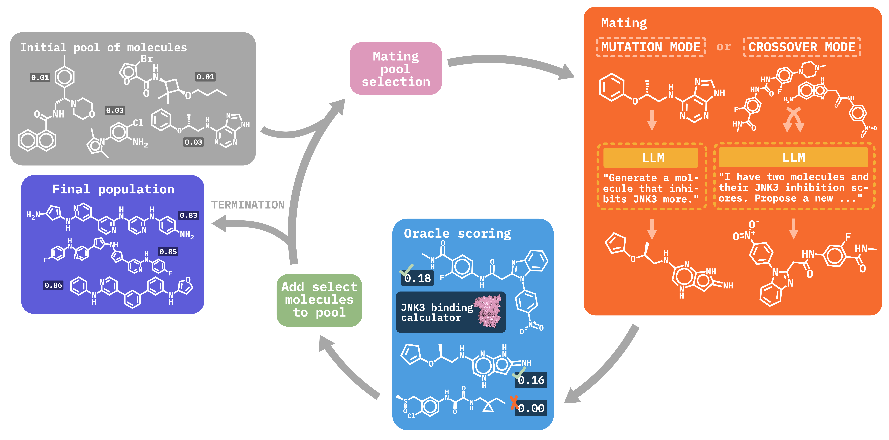

# MOLLEO

[arXiv] [Efficient Evolutionary Search Over\\ Chemical Space with Large Language Models](https://arxiv.org/abs/2406.16976)

[Website] [MOLLEO Project](https://molleo.github.io/)

## Abstract

Molecular discovery, when formulated as an optimization problem, presents significant computational challenges because optimization objectives can be non-differentiable. 
Evolutionary Algorithms (EAs), often used to optimize black-box objectives in molecular discovery, traverse chemical space by performing random mutations and crossovers, leading to a large number of expensive objective evaluations.
In this work, we ameliorate this shortcoming by incorporating chemistry-aware Large Language Models (LLMs) into EAs.
Namely, we redesign crossover and mutation operations in EAs using LLMs trained on large corpora of chemical information. We perform extensive empirical studies on both commercial and open-source models on multiple tasks involving property optimization, molecular rediscovery, and structure-based drug design, demonstrating that the joint usage of LLMs with EAs yields superior performance over all baseline models across single- and multi-objective settings. 
We demonstrate that our algorithm improves both the quality of the final solution and convergence speed, thereby reducing the number of required objective evaluations.





## Setups
You need to get an OpenAI API key. Price: BioT5

### Package Installation
Comming soon


### Experiments
The experiments are conducted on the following categories: `single obejective optimization` and `multi objective optimization`.

To run experiments on single objective optimization task:

```bash
cd single_objective 
```
To run experiments on multi objective optimization task:

```bash
cd multi_objective 
```

## Citation
If you find our work helpful, please consider citing our paper:

```
@misc{wang2024efficientevolutionarysearchchemical,
      title={Efficient Evolutionary Search Over Chemical Space with Large Language Models}, 
      author={Haorui Wang and Marta Skreta and Cher-Tian Ser and Wenhao Gao and Lingkai Kong and Felix Streith-Kalthoff and Chenru Duan and Yuchen Zhuang and Yue Yu and Yanqiao Zhu and Yuanqi Du and Alán Aspuru-Guzik and Kirill Neklyudov and Chao Zhang},
      year={2024},
      eprint={2406.16976},
      archivePrefix={arXiv},
      primaryClass={cs.NE}
      url={https://arxiv.org/abs/2406.16976}, 
}
```